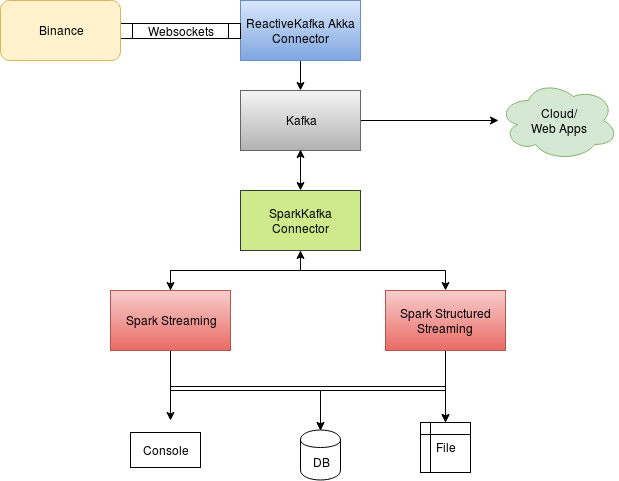
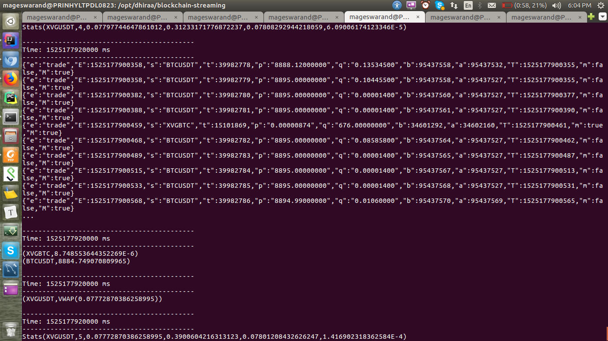

## Spark Blockchain Streaming Analytics




## Choice of Tools

- [Akka](https://github.com/akka)
    - [ReactiveKafka](https://github.com/akka/reactive-kafka) is been used to pull data from websockets
    - For websocket connectors, the initial plan was to use Spark Streaming Custom receiver, but later Akka took its place
as it can be easily integrated to Kafka and can be controlled outside the Spark realm.
    - Though Akka is designed for distributed environment, how to make this work in cluster mode for 1000s of streams is a topic of its own Google search!
- [Kafka](https://kafka.apache.org)
    - Kafka was choosen as it is the buzz word in the market for Streaming and lot of community support. Nothing else!!!
- [Spark Streaming](https://spark.apache.org/docs/latest/streaming-programming-guide.html)
- [Spark Structured Streaming](https://spark.apache.org/docs/latest/structured-streaming-programming-guide.html)
    - Initially to do some aggregations and statefull operations Spark Strucuted streaming was choosen, later I had to fall back
to Streaming since there are some [limitations](https://spark.apache.org/docs/latest/structured-streaming-programming-guide.html#unsupported-operations)


## Future Work
**Replay Function**   
Q) Is it possible to provide an API that has to use past data to get some insight on the streaming data?   
A) Since we are using Kafka as our Message handling system, one possible solution given choice of tools and design, 
we can use `offsets` property while loading the source and register it as a SQL table and do ad-hoc query over the REST API   
    - https://stackoverflow.com/questions/46153105/how-to-get-kafka-offsets-for-structured-query-for-manual-and-reliable-offset-man   
    - https://blog.cloudera.com/blog/2017/06/offset-management-for-apache-kafka-with-apache-spark-streaming/

**How to serve 1000s of consumer apps in the Down stream?**
- There are couple of ways this can be done.
- By registering the incoming stream as a structured Dataframe/Table to Spark SQL engine, the registered table then can
used to query any business logic over some existing Spark REST endpoint connectors
- The other way would be  re-route the Spark Analytics results to Kafka topics and use Kafka REST APIs to subscribe and 
get to know the results
- References:
    - https://spoddutur.github.io/spark-notes/build-real-time-interations-with-spark.html
    - https://github.com/spoddutur/spark-as-service-using-embedded-server
    - https://livy.incubator.apache.org/
    - https://github.com/confluentinc/kafka-rest

# How to run?

Each of the following command needs to be executed on seprate terminal.

### Kafka

Download Kafka [here](https://kafka.apache.org/downloads)

- Start the Zookeeper server:

```
cd /path/to/kafka_2.11-1.1.0
  
bin/zookeeper-server-start.sh config/zookeeper.properties
```
   
-  Start the Kafka Server:

```
bin/kafka-server-start.sh config/server.properties
```
  
-  Start the Kafka Consumer on port 9092 with any topic of choice:

```
bin/kafka-console-consumer.sh --bootstrap-server localhost:9092 --topic binance --new-consumer

```
   
### Akka
 
```
cd /path/to/blockchain-streaming/
sbt
runMain com.binance.kafka.BinanceProducer
``` 

### Spark 

- **Start Spark Streaming Analytics**
    - It listens for `XVGBTC` streams and `BTCUSDT` streams and calculates 
    `XVGUSBT` VWAP-Volume Weighted Average Price and Std. deviation of the same
    over given time period 
- Results are written @ `/tmp/blockchain-streaming/binance/`
- Statistics of the stream is printed as Stats("XVGUSDT", numEvents, vwap, mean, sum, std)

```
cd /path/to/blockchain-streaming/
sbt
runMain com.binance.Streaming --batch-time-in-seconds 30
``` 



**or (to save resources on single machine)**

- **Start Spark Streaming Analytics** 
    - Due to [limitation](https://spark.apache.org/docs/latest/structured-streaming-programming-guide.html#unsupported-operations), this does not mimic above streaming logic 
    - However there are other interesting stuff that can be done like MSG Streams ---> Kafka **<--->** Spark Streaming Analytics
    
```
cd /path/to/blockchain-streaming/
sbt
runMain com.binance.StructuredStreaming --batch-time-in-seconds 30

#on a seprate terminal from 
cd /path/to/kafka_2.11-1.1.0
bin/kafka-console-consumer.sh --bootstrap-server localhost:9092 --topic vwap --new-consumer
```


# References:
### Tutorials
- **https://spark.apache.org/docs/latest/structured-streaming-programming-guide.html**
- **https://doc.akka.io/docs/akka-stream-kafka/current/producer.html**
- **https://databricks.com/blog/2017/05/08/event-time-aggregation-watermarking-apache-sparks-structured-streaming.html**
- https://www.instaclustr.com/apache-spark-structured-streaming-dataframes/
- http://spark.apache.org/docs/latest/streaming-custom-receivers.html
- https://forums.databricks.com/questions/2095/sparkstreaming-to-process-http-rest-end-point-serv.html
- https://www.supergloo.com/fieldnotes/spark-streaming-example-from-slack/
- https://medium.com/zappos-engineering/creating-a-scalable-websocket-in-an-hour-f7fb217e3038
- https://www.confluent.io/blog/building-a-microservices-ecosystem-with-kafka-streams-and-ksql/
- https://blog.knoldus.com/2016/06/13/a-simple-example-to-implement-websocket-server-using-akka-http/
- https://www.microsoft.com/developerblog/2017/11/01/building-a-custom-spark-connector-for-near-real-time-speech-to-text-transcription/
- https://dzone.com/articles/creating-a-scalable-websocket-application-in-an-ho
- https://www.playframework.com/documentation/2.6.x/ScalaWebSockets
- https://stackoverflow.com/questions/40009591/pandas-dataframe-vwap-calculation-for-custom-duration
- https://stackoverflow.com/questions/44854512/how-to-calculate-vwap-volume-weighted-average-price-using-groupby-and-apply?rq=1
- http://redsofa.ca/post/a_simple_spark_structured_streaming_example/

### Git:
- **https://github.com/imranshaikmuma/Websocket-Akka-Kafka-Spark**
- https://gist.github.com/samklr/219c9f5a7c4a3f4853808e5a6d2326b0
- https://github.com/rstml/datastax-spark-streaming-demo
- https://github.com/atemerev/spark-streaming-websocket
- https://github.com/granthenke/spark-demo

